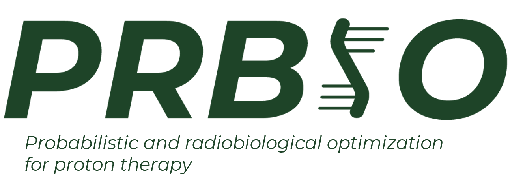

# Probabilistic and RadioBIOlogical optimizations for proton therapy

## What is PRBIO

PRBIO in an OpenTPS library for probabilistic and radiobiological optimizations
in proton therapy. 
\
More information about OpenTPS can be found at www.opentps.org.

PRBIO has been developed by Eliot Peeters and Romain Schyns in the context of their master thesis 
in Biomedical Engineering at UCLouvain. Supervisors are Prof. John Lee and Prof. Edmond Sterpin.

Final manuscript *"Exploring the computational and clinical added-value of probabilistic optimization in proton therapy"*
can be found [here](https://dial.uclouvain.be/memoire/ucl/en/object/thesis%3A48785).

**Authors provide the code as is and no warranty is given. This is work is solely for research purposes and should not be
used for clinical purposes.**

## How to use PRBIO

PRBIO is an extension of OpenTPS. To use PRBIO, you need to have OpenTPS installed on your machine.\
The optimization framework is based on the OpenTPS optimization framework.\

To optimize a plan with PRBIO, you will need to create a plan through OpenTPS and then use the PRBIO optimizers.


```python
# Do not forget the subsequent imports of OpenTPS not detailed here

import PRBIO
from PRBIO import RadiobiologicalPlanOptimizer
from PRBIO import ProbabilisticPlanOptimizer
from PRBIO import BiologicalObjectiveList

# Probabilistic optimization

plan.planDesign.objectives = ObjectivesList()
plan.planDesign.objectives.setTarget(target.name, prescription)

plan.planDesign.objectives.addFidObjective(target,FidObjective.Metrics.DMAX, 72, 10)
plan.planDesign.objectives.addFidObjective(target,FidObjective.Metrics.DMIN, 68, 30)

plan.planDesign.objectives.addFidObjective(spinalcord,FidObjective.Metrics.DMAX, 15,4 )
plan.planDesign.objectives.addFidObjective(parotid_r,FidObjective.Metrics.DMAX, 25, 1)
plan.planDesign.objectives.addFidObjective(parotid_l,FidObjective.Metrics.DMAX, 25, 1)
plan.planDesign.objectives.addFidObjective(smg_l,FidObjective.Metrics.DMAX, 25, 1)
plan.planDesign.objectives.addFidObjective(smg_r,FidObjective.Metrics.DMAX, 25, 1)
plan.planDesign.objectives.addFidObjective(pharConsMid,FidObjective.Metrics.DMAX, 20, 5)
plan.planDesign.objectives.addFidObjective(body,FidObjective.Metrics.DMAX, 30, 1)


solver = ProbabilisticOptimizer( CTD=ctd,plan= plan)

# Radiobiological optimization
plan.planDesign.objectives = BiologicalObjectiveList()
plan.planDesign.objectives.setTarget(target.name, prescription)

plan.planDesign.objectives.addBiologicalObjective(target,10, 1*alpha, eta, beta=alpha/10)
plan.planDesign.objectives.addBiologicalObjective(parotid_r, 1, 1*alpha, eta, beta=alpha/3)
plan.planDesign.objectives.addBiologicalObjective(parotid_l, 1, 1*alpha, eta, beta=alpha/3)
plan.planDesign.objectives.addBiologicalObjective(smg_l, 1, 1*alpha, eta, beta=alpha/3)
plan.planDesign.objectives.addBiologicalObjective(smg_r, 3, 1*alpha, eta, beta=alpha/3)
plan.planDesign.objectives.addBiologicalObjective(pharConsMid, 10, 1*alpha, eta, beta=alpha/3)

solver = RadiobiologicalPlanOptimizer(plan, ctd,initial_weights=None, gamma=gamma, Nfractions=Nfrac)
````

## Contacts 
> **[Eliot Peeters](https://www.linkedin.com/in/eliot-peeters-a48b03257/)** *(UCLouvain/IREC/MIRO)* : eliot.peeters@uclouvain.be \
> **[Romain Schyns](https://www.linkedin.com/in/romain-schyns-290b04257/)** *(UCLouvain/IREC/MIRO)* : romain.schyns@uclouvain.be  


